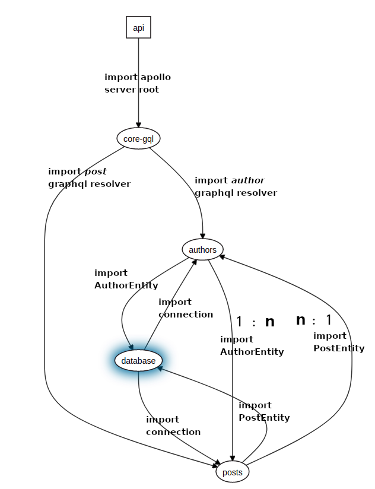

In the monorepo, it's not possible to combine all entities with `__dirname + '/../*/.entity{.ts,.js}',`  as soon as it throws the Error: `Cannon use import statement outside a module`. So every Entity should be imported directly manually and it creates unresolved Errors `A circular dependency between modules`.

Api visualisation:

